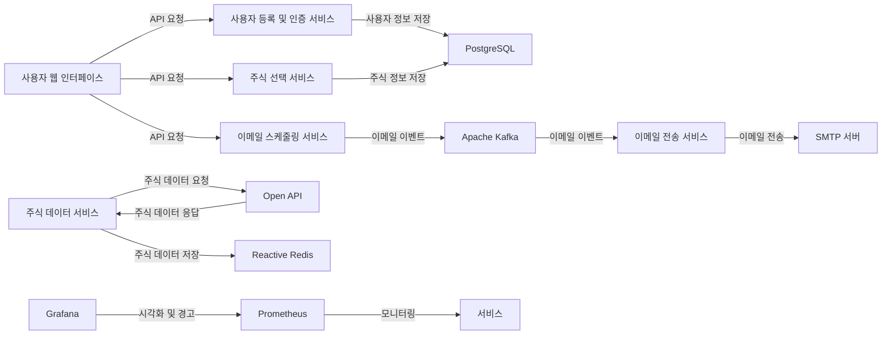

   \
   

interstella 의 tars를 모티브로 했습니다. \
사용자가 원하는 주식 정보를 이메일로 받아볼 수 있도록 등록하고 설정하는 서비스 입니다.

## 목차

-   [서비스 개념](https://chat.openai.com/chat?model=gpt-4#%EC%84%9C%EB%B9%84%EC%8A%A4-%EA%B0%9C%EB%85%90)
    -   [초기 목표](https://chat.openai.com/chat?model=gpt-4#%EC%B4%88%EA%B8%B0-%EB%AA%A9%ED%91%9C)
-   [서비스 아키텍처](https://chat.openai.com/chat?model=gpt-4#%EC%84%9C%EB%B9%84%EC%8A%A4-%EC%95%84%ED%82%A4%ED%85%8D%EC%B2%98)
    -   [Mermaid 코드로 작성된 서비스 아키텍처](https://chat.openai.com/chat?model=gpt-4#mermaid-%EC%BD%94%EB%93%9C%EB%A1%9C-%EC%9E%91%EC%84%B1%EB%90%9C-%EC%84%9C%EB%B9%84%EC%8A%A4-%EC%95%84%ED%82%A4%ED%85%8D%EC%B2%98)
-   [주요 기능](https://chat.openai.com/chat?model=gpt-4#%EC%A3%BC%EC%9A%94-%EA%B8%B0%EB%8A%A5)
-   [설치 필요 사항](https://chat.openai.com/chat?model=gpt-4#%EC%84%A4%EC%B9%98-%ED%95%84%EC%9A%94-%EC%82%AC%ED%95%AD)

### 초기 목표

1.  사용자 등록 및 로그인 기능 구현
2.  관심 주식 선택 및 관리 기능 구현
3.  이메일 알림 시간 설정 기능 구현
4.  주기적인 주식 데이터 업데이트 및 캐싱
5.  서비스 모니터링 및 경고 기능 구현

## 서비스 아키텍처

### 서비스 아키텍처

## 주요 기능

1.  사용자 등록 및 로그인
2.  관심 주식 선택
3.  이메일 알림 시간 설정
4.  주식 데이터 업데이트 및 캐싱
5.  서비스 모니터링 및 경고
